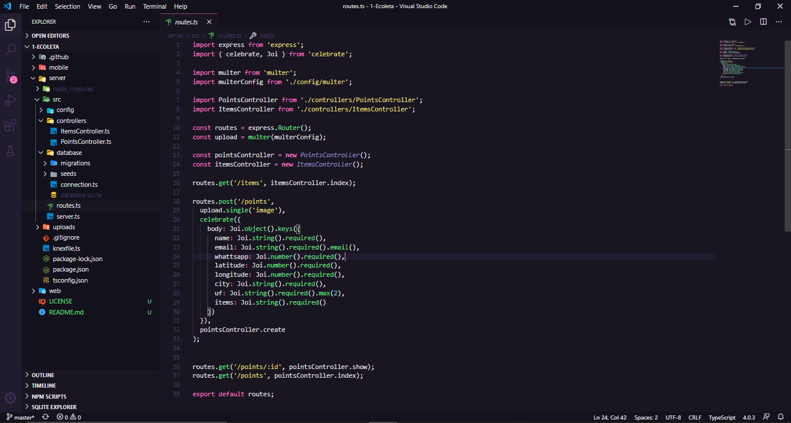
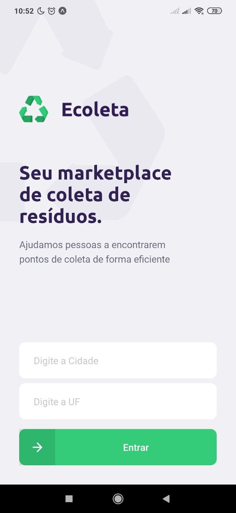

<h1 align="center">
  
  <br/>
</h1>

<p align="center">
  <a href="https://github.com/iybe">
    
  </a>

  <a href="#">
    
  </a>

  <a href="https://github.com/iybe/Ecoleta/stargazers">
    
  </a>

  <a href="https://github.com/iybe/Ecoleta/commits/master">
    
  </a>

  <a href="#">
    
  </a>

  <a href="https://github.com/iybe/Ecoleta/blob/master/LICENSE.md">
    
  </a>
</p>

<br />

### 💻 Projeto

Projeto desenvolvido durante a <strong>Next Level Week</strong> 1 que tem como objetivo conectar coletores de resíduos e locais de coleta.

<br />

### 🔨 API

<h1 align="center">
  
</h1>

### 🌐 WEB

<h1 align="center">
    
</h1>

### 📱 Mobile

<h1 align="center">
    
</h1>

<br />

## 🚀 Tecnologias

Esse projeto foi desenvolvido com as seguintes tecnologias:

- [Node.js](https://nodejs.org/en/)
- [React](https://reactjs.org)
- [React Native](https://facebook.github.io/react-native/)
- [Expo](https://expo.io/)
- [Knex](http://knexjs.org/)
- [Yup](https://github.com/jquense/yup)
- [Celebrate](https://github.com/arb/celebrate)
- [API do IBGE para consumo do endereço](https://servicodados.ibge.gov.br/api/docs/localidades?versao=1#api-UFs-estadosGet)
- [React-Dropzone para upload de imagens](react-dropzone)
- [Leaflet](https://leafletjs.com/examples/quick-start/)

<br />

## 🔥 Instalação

```bash
# Clone este repositório
$ git clone https://github.com/iybe/Ecoleta.git

# Navegue até a pasta api e execute os seguintes comandos:
$ yarn
$ npx knex migrate:latest
$ npx knex seed:run
$ yarn dev

# Depois disso, entre na pasta web e execute os comandos:
$ yarn
$ yarn start

# E finalmente, entre na pasta mobile e execunte os comandos:
$ yarn
$ expo start

# Observações:
- Não esqueça de mudar a baseURL no arquivo `src/services/api.ts` da pasta mobile para o IP da sua máquina
```

<p align="center">
  Made with ❤ by <a href="https://www.linkedin.com/in/iesleybezerra/"> Iesley Bezerra </a>
</p>